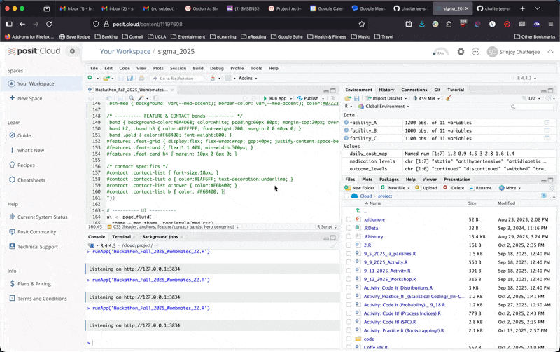

.png)
**Category:** Health Systems (Prompt 4)

---

## 🧩 Overview

**MedHive** is a quality-control dashboard built in **R (Shiny)** to track and reduce **prescription medication waste** in nursing homes.  
It helps staff identify preventable causes, visualize trends across medications and prescribers, and test “first-fill” policy simulations to reduce waste costs.

---

## 🎥 Demo

Here’s a quick look at the **MedHive Dashboard** in action:



> *A short animated demo showing data upload, filtering, Pareto visualization, and simulated savings.*

---

## ⚙️ Features

- **Charts:** Pareto, distributions, and SPC-style time series  
- **Breakdowns:** By medication and prescriber  
- **Operational alerts:** Flags preventable or process-related waste  
- **Policy simulator:** Estimates savings from shorter first fills  
- **Ready to demo:** Works with included synthetic datasets

---

## 📦 Files

| File | Description |
|------|-------------|
| `app.R` | Shiny dashboard (main file to run). |
| `CODEBOOK.md` | Variables, units, and dataset descriptions. |
| `medhive_facility_A_waste.csv` | High-waste facility dataset. |
| `medhive_facility_B_waste.csv` | Low-waste facility dataset. |
| `medhive_facility_C_waste.csv` | Balanced facility dataset. |

---

## 🧠 How to Run the Dashboard

### Option 1: In **RStudio (Local)**

To install required packages and launch the dashboard:

```r
# install dependencies
install.packages(c(
  "shiny", "tidyverse", "lubridate", "scales",
  "DT", "janitor", "bslib"
))

# run the app
shiny::runApp("app.R")
```

Then upload one or more of the provided CSVs when prompted.

---

### Option 2: In **Posit Cloud**

```r
# steps:
# 1. Create a new R project
# 2. Upload app.R and all CSVs
# 3. Install required packages
install.packages(c(
  "shiny", "tidyverse", "lubridate", "scales",
  "DT", "janitor", "bslib"
))

# 4. Run the app
shiny::runApp("app.R")
```

---

## 📊 Example Insights

- **Top Prescribers (Waste):** Shows clinicians with highest preventable waste cost  
- **Operational Alerts:** Flags causes like refills after patient transfer or end-of-therapy  
- **Pareto Chart:** Highlights medications contributing most to total waste  
- **Policy Simulator:** Models savings from reducing first-fill fractions

---

## 🧰 Tool Documentation & Function Reference

### Overview

The **MedHive Dashboard** is a reproducible R Shiny tool that imports CSV datasets, calculates waste metrics, and generates actionable insights for nursing home administrators.  
All code is contained in `app.R` and runs fully in RStudio or Posit Cloud.

---

### Workflow

1. Upload or auto-load facility CSVs from `/data/`  
2. The tool:
   - Cleans and merges data  
   - Calculates derived variables (`unit_cost`, `waste_cost`, etc.)  
   - Applies user filters (date, medication, prescriber)
3. Generates:
   - Time-series plots of weekly waste  
   - Pareto and distribution charts  
   - Operational alerts and savings simulations

---

### Functions and Parameters

| Function | Location | Purpose | Key Inputs / Parameters | Outputs |
|-----------|-----------|----------|--------------------------|----------|
| `read_one_csv(path, label = NULL)` | `app.R` | Reads and cleans each dataset | `path`: CSV path; `label`: facility name | Cleaned data frame with derived fields |
| `in_control_limits(x)` | `app.R` | Calculates SPC control limits (mean ± 3σ) | Numeric vector `x` | Tibble with `center`, `ucl`, `lcl`, `sigma` |
| `flags_tbl()` | Server reactive | Identifies operational issues and improvement opportunities | Uses filtered dashboard data | Table of alert messages and estimated savings |
| `sim_detail()` | Server reactive | Simulates waste reduction from first-fill fraction changes | `input$first_fill_frac` (slider) | Simulated savings by medication |
| `bee_theme_plot()` | `app.R` | Applies consistent styling to all ggplot charts | none | ggplot2 theme object |
| `filtered()` | Server reactive | Filters the dataset based on user input | `input$date`, `input$meds`, `input$docs` | Filtered tibble for visualizations |

---

### User Inputs

| Input | Description | Type | Default |
|--------|--------------|------|----------|
| `files` | CSV uploads | File input | Required |
| `date` | Filter by scheduled date range | Date range | 2025-08-01 → 2025-10-31 |
| `meds` | Filter by medication | Selectize multi | All |
| `docs` | Filter by prescriber | Selectize multi | All |
| `first_fill_frac` | Policy simulator slider | Numeric (0.25–1.0) | 0.5 |
| `show_points` | Toggle control chart points | Checkbox | TRUE |

---

### Outputs and Visualizations

| Tab | Description | Type |
|------|-------------|------|
| **Time Series** | SPC-style chart of weekly waste cost with ±3σ limits | Line plot |
| **Pareto** | 80/20 visualization of highest-impact meds/prescribers | Dual-axis Pareto chart |
| **Distributions** | Histograms of % wasted and waste cost | Histogram |
| **Operational Alerts** | Data table of process-improvement suggestions | DT::datatable |
| **Policy Simulator** | Modeled savings based on shorter first fills | Plot + data table |
| **Top Prescribers (Waste)** | Summary of preventable waste by clinician | Data table |

---

## 📂 Data Reference

See **[`CODEBOOK.md`](./CODEBOOK.md)** for:
- Dataset descriptions for Facilities A, B, and C  
- Full variable dictionary with units and definitions  

> All weights (`initial_weight`, `weight_at_stop`) are in **grams (g)**.  
> All costs (`cost_usd`) are in **USD ($)**.

---

## 🧾 License & Attribution

- Synthetic data for educational demonstration  
- © 2025 **Team MedHive**, Cornell Systems Engineering M.Eng.  
- Licensed under **CC BY 4.0**

---

### 🐝 “Smarter Prescriptions. Less Waste.”
